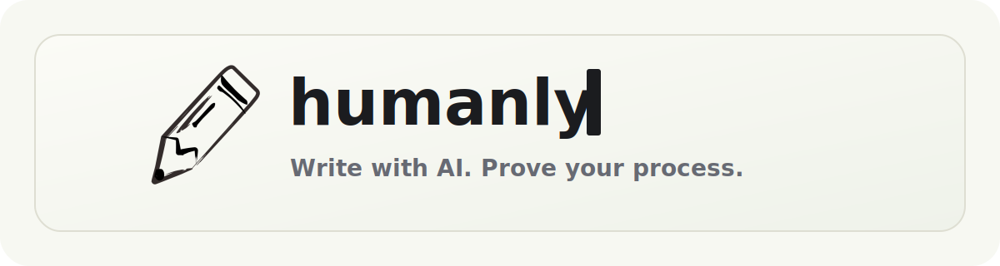

<p align="center">
  
</p>

<p align="center">
  <strong>Write with AI. Prove your process.</strong>
</p>

<p align="center">
  <a href="#overview">Overview</a> ·
  <a href="#product">Product</a> ·
  <a href="#certificates">Certificates</a> ·
  <a href="#repository">Repository</a>
</p>

<p align="center">
  <a href="https://app.writehumanly.net/"></a>
  <a href="https://admin.writehumanly.net/"></a>
  <a href="https://github.com/ShenzheZhu/humanly/releases/tag/v0.4.0"></a>
  <a href="./LICENSE"></a>
</p>

<h2 id="overview">Overview</h2>

Humanly is a writing platform that records how a document is produced inside a
controlled workspace. It focuses on provenance: the writing environment, the
writer's activity, in-platform AI use, and the evidence attached to the final
document.

Instead of only judging final text, Humanly turns the writing process into a
shareable certificate.

<h2 id="product">Product</h2>

- Configurable writing workspaces for personal writing and assigned tasks.
- In-platform AI modes for off, polish-only, chat-only, or full assistance.
- Process tracing for writing activity, workspace activity, and AI interaction.
- Workspace preview before a task or document begins.
- Public certificate links for review and verification.

Live product:

- User portal: [app.writehumanly.net](https://app.writehumanly.net/)
- Admin dashboard: [admin.writehumanly.net](https://admin.writehumanly.net/)

<h2 id="certificates">Certificates</h2>

A Humanly certificate can show authorship statistics, the active writing
environment, replay, review signals, and certificate integrity details.

Certificates are evidence for review. They describe what happened inside the
Humanly workspace and do not make claims about off-platform behavior.

<h2 id="repository">Repository</h2>

This repository contains the Humanly product code.

```text
packages/backend        API, storage, events, certificates, AI
packages/frontend       Admin dashboard
packages/frontend-user  User portal and writing workspace
packages/editor         Writing editor
packages/tracker        External-form tracking library
packages/shared         Shared types
docs/                   Maintainer and deployment documentation
```

For setup, QA, deployment, and maintainer documentation, see
[docs/README.md](docs/README.md).

Release notes are tracked in [CHANGELOG.md](CHANGELOG.md).
